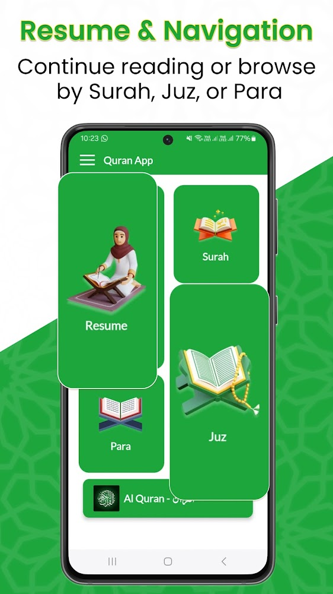
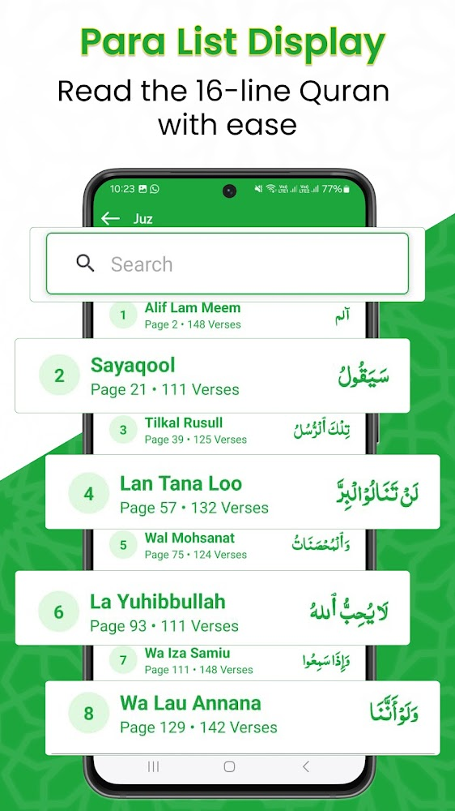
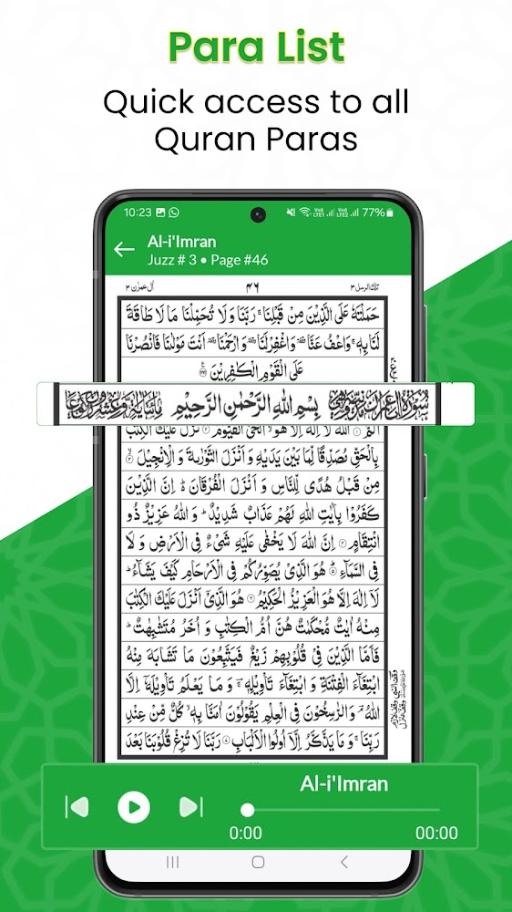
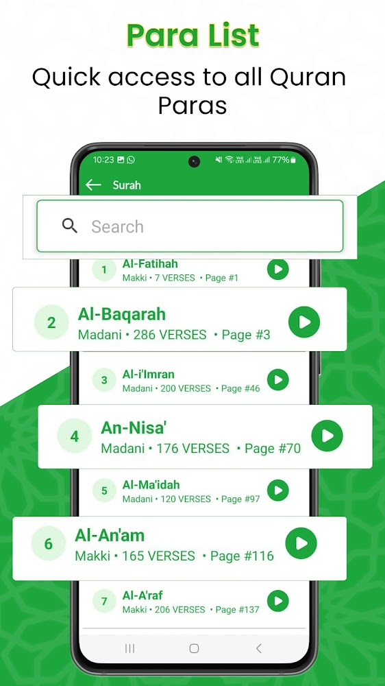
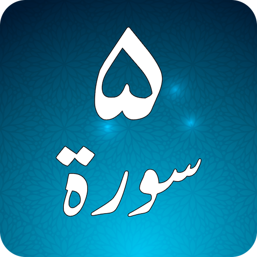
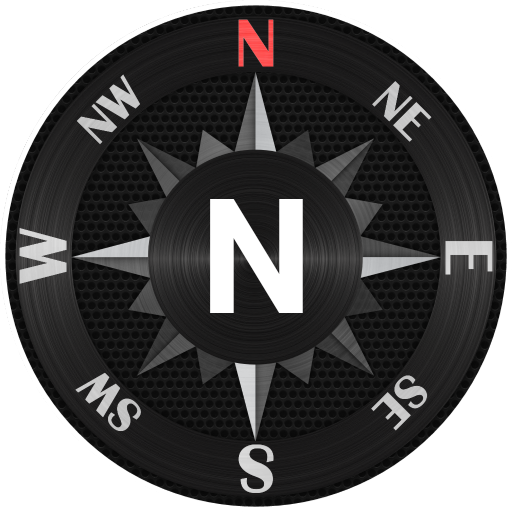
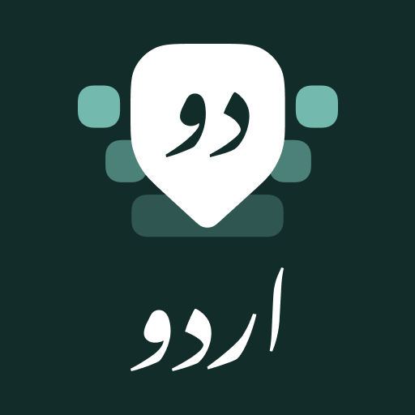

# 📖 Holy Quran (16 Lines per page)

  

  

  

This is a full-fledged Android application that I developed and built **completely from scratch in Java** during my time at **Zeesoft Tech**.

The app is designed for comfortable daily recitation. It follows the traditional **16 lines per page Mushaf layout**, making it ideal for readers, Quran students, and Huffaz who are familiar with classic printed Qurans used in madrasas and masjids worldwide.

With **over 10,000+ active downloads** on the Google Play Store, this app provides a peaceful, distraction-free reading experience that works completely offline.

## 👨‍💻 My Role & Contributions

As the **Lead Android Developer**, I solely designed, architected, and developed the entire application from the ground up using **Java**. My key technical contributions included:

* **☕ Ground-up Java Architecture:** Designed and built the complete app structure from scratch in Java, optimizing text rendering and page rendering performance.
* **📖 Traditional Mushaf Page Layout:** Re-engineered the classic 16-line printing layout digitally, ensuring that page boundaries and font sizing perfectly match printed Qurans to aid in Hifz (memorization).
* **⚡ Optimized Page Navigation:** Built a high-speed, low-memory page navigation and paging system that loads Arabic text instantly and handles smooth swipe transitions.
* **📴 Full Offline Support:** Integrated local resource caching and database managers so the app works entirely offline after installation without requiring a network connection.

## 🔒 Code Sharing & Intellectual Property Notice

Because this app is actively published and holds proprietary commercial value, **the source code cannot be shared publicly** due to my confidentiality agreement with **Zeesoft Tech**. 

This repository is created solely to showcase:
* The design and user interface of the app.
* The features and user workflows.
* The clean Java programming and product architecture.

## 🚀 Key Features

### 📖 Traditional 16-Line Layout
* **Familiar Page Layout:** Follows the classic print layout used worldwide, keeping page divisions identical to printed copies to assist in memorization (Hifz).

### 🔍 Clear and Readable Arabic Text
* **Optimized Typography:** High-contrast, clean, and highly readable Arabic fonts suited for users of all ages.

### 📴 Complete Offline Access
* **Read Anywhere:** No active internet connection is required to read, swipe, or navigate through the pages after installation.

### 🌙 Simple & Distraction-Free Design
* **Focus on Reading:** A clutter-free user interface designed without unnecessary buttons or options to ensure maximum focus on recitation.

### 📱 Smooth & Fast Navigation
* **Paging Engine:** A highly optimized engine allowing users to swipe or jump through pages with near-zero latency.

## 📱 App Screenshots

Here is a look at the final traditional 16-line layouts and reading interface screens that I built:

  
  
  

  
  
  

  
  
  

  
  
  

## 🏢 Project Details
* **Role:** Lead Developer (Ground-up Java Architecture & Full-Stack Development)
* **Company:** Zeesoft Tech
* **Availability:** Available on the Google Play Store (**10K+ Downloads**), [**Download Now**](https://play.google.com/store/apps/details?id=com.awami.alquran.holyquran.sixthteenlines)